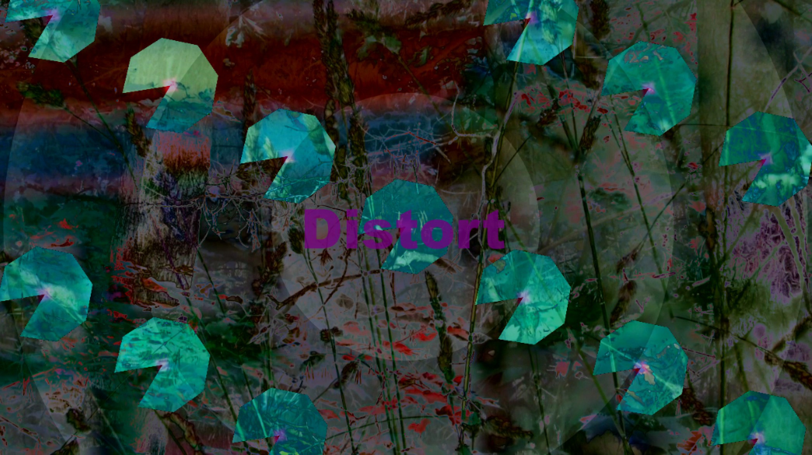
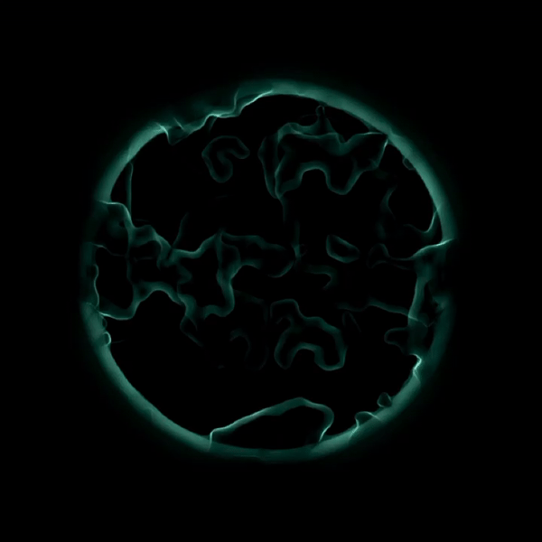

# Documentation

## Abstract

**What was the whole project about, what did you archive...**

## Concept

The main concept for this project was to do an interactive installation, which concists of a wooden structure as projection surface. The projected visuals are abstract schools of fish. When the audience approaches the installation the fishes react according to the hand movement of the user. 
Through this installtion we want to bring attention to the human impact on marine ecosystem, in this case on coral reefs and it's inhabitants. This is also depicted in the form of the structure, which resemebles coral reefs, more specifically Acropora Hyacinthus coral plates. 

Human activities affect marine ecosystems as a result of pollution, overfishing, oil spills, and acidification, which lead to the extinction of marine species and have major effect on the biodiversity of marine life forms. The effect on the ecosystem can be noticed through the rapid worldwide decline in coral reefs. Coral reefs are the most diverse marine ecosystems on earth, giving shelter to thousands of animal species. They account for one-third of all biodiversity in the oceans and are vital to humanity. As a result of human influence, over [50 percent](http://www.secore.org/site/corals/detail/why-coral-reefs-need-our-help.23.html) of the world’s coral reefs have died in the last 30 years and up to 90 percent may die within the next century. 

 

In this prototype the human influence on nature is represented through the hand interaction of the viewer, which leads to the movement of the fishes in the the opposite direction, giving an impression of fleeing. More complex forms of interaction are mention in section [Future work](#Future_Work). 

## Implementation

**How did you do it? Pipeline, execution details, etc.**

### Idea Development

For brainstorming and to make a list of resources we used [Miro board](https://miro.com) since it is excellent for getting an overview and all parties can edit the board. It helped us in finalising our concept as well as for resource management.

### Wooden Structure

MDF wooden board 

- test first cut (image)

### Projection Mapping

In order to get optimal visual results we tested the projection on different surfaces and color. The best results we achieved were on dark surfaces, hence it was decided to paint the MDF boards in black paint. 

 

### TouchDesigner

In order to get familiar with TouchDesigner we followed [several tutorials](https://www.youtube.com/watch?v=Z_WfldiO6HI&list=PLFrhecWXVn5862cxJgysq9PYSjLdfNiHz), that included working with different operators such as TOP, CHOP, SOP, MAT, DAT, and COMP. Different types of operators are used for different purposes and classes, for example, **TOPs** are texture operators and work with 2D imagery (pixels), videos, 2D shapes, and text. **CHOP** are channel operators and work with data/signals. **SOP** are surface operators and are used for 3D geometry. **MAT** are material operators and **DAT** are used for scripts. texts and GLSL. Last but not least are COMP, they are a combination of several operators and include elements such as camera, light, animation, etc. 

Some of our results from the tutorials are as following:

 

### Boid System

- formula
The Boids Rules
- Rule 1: Boids try to fly towards the centre of mass of neighbouring boids. (rule1 - cohesion - always travel towards center of group)
- Rule 2: Boids try to keep a small distance away from other objects (including other boids). (rule2 - avoid other boids)
- Rule 3: Boids try to match velocity with near boids.
- go towards target
- Limiting the speed
- Bounding the position

### Interaction

-(interaction sketches)
- Leap motion

### Testing

## Results

**Documentation of your result(s), e.g. images.**

### First Prototype

## Project Reflection & Discussion

- invested time on learning touchDesigner
- underestimated the complexity of touchdesigner 
- wanted to have more progress than just a prototype

**What worked well, what didn't work and why? In which context does your project stand? Future Work?**

### Future_Work 

- more organic form of boids (viuals)
- particle system 
- sound
- water reflection
- improved interaction 
- oil layer 
- change of movement according to the oil density 

## Lessons Learned

- TouchDesigner
- Build a project from conception to implementation 
- projection mapping (surface test, color, scale and scope)
- Interaction through leapmotion 
