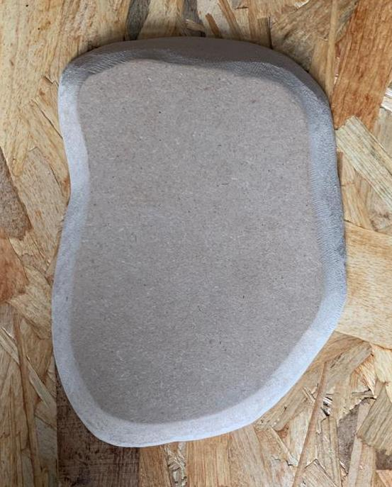

# Documentation

## Abstract

**What was the whole project about, what did you archive...**

## Concept

The main concept for this project was to do an interactive installation, which concists of a wooden structure as projection surface. The projected visuals are abstract schools of fish. When the audience approaches the installation the fishes react according to the hand movement of the user. 
Through this installtion we want to bring attention to the human impact on marine ecosystem, in this case on coral reefs and it's inhabitants. This is also depicted in the form of the structure, which resemebles coral reefs, more specifically Acropora Hyacinthus coral plates. 

Human activities affect marine ecosystems as a result of pollution, overfishing, oil spills, and acidification, which lead to the extinction of marine species and have major effect on the biodiversity of marine life forms. The effect on the ecosystem can be noticed through the rapid worldwide decline in coral reefs. Coral reefs are the most diverse marine ecosystems on earth, giving shelter to thousands of animal species. They account for one-third of all biodiversity in the oceans and are vital to humanity. As a result of human influence, over [50 percent](http://www.secore.org/site/corals/detail/why-coral-reefs-need-our-help.23.html) of the world’s coral reefs have died in the last 30 years and up to 90 percent may die within the next century. 

#### Acropora Hyacinthus coral plates

 

In this prototype the human influence on nature is represented through the hand interaction of the viewer, which leads to the movement of the fishes in the the opposite direction, giving an impression of fleeing. More complex forms of interaction are mention in section [Future work](#Future_Work). 

## Implementation

**How did you do it? Pipeline, execution details, etc.**

### Idea Development

From the very beginning it was clear to us that we wanted to address the topic of climate change or human impact on different ecosystems. For brainstorming and to make a list of resources we used [Miro board](https://miro.com) since it is excellent for getting an overview and all parties can edit the board. It helped us in finalising our concept as well as for resource management. After the intital brainstorming sesssion we decided on implementing visuals in TouchDesigner, since both of us wanted to get in touch with this tool. For the interaction we thought of using either Kinect or LeapMotion. 

#### Concept sketch 

This is the first concept sketch we came up with. The idea was that the structure resembles coral plates and the interaction possibility is with the hand movements. We also wanted to use some sort of container with water to generate water refelection around the area of installation with the help of lights. 

### Wooden Structure

We collaborated with **Marie Scharnagl** a capenter apprentice. With her we discussed about using different materials and decided to use MDF wooden boards for the structure for several reasons. It is for once cost-saving and we could use leftover material from Marie's workshop. Also, MDF is softer than other wooden materials, which is optimal for cutting the curves and digonal edges that we wanted. As mentioned above the plates are cut in the form of coral plates that are stacked on top of each other. We discussed different factors regarding the design, e.g how many plates we wanted to use, how they are distributed, waht size they have. We decided on using less plates but in bigger sizes so that we have a larger projection field which provides us with a continuous projection area. The distance in height between the plates was also an importatn aspect for the continuous projection and to avoid interruption. For the color we decided to use semi-glossy black paint to get a high contrast and enuough reflection for the projection.

#### First cut test

The first test plate can be seen in the figure below. We tested different aspects regarding the material, form, and thickness of the plate. 

 

#### Assembly

After the paint was dry we assembled all the plates and mounted them on four table legs in order to get necessary height. For now we used non-adustable legs but in the future we would like to substitute it with telescope desk legs, so that the height of the structure can be adjusted accordingly. 

 

  

 

### Projection Mapping

In order to get optimal visual results we tested the projection on different surfaces and color. The best results in terms of contrast and reflectivity we achieved were on dark surfaces, hence it was decided to paint the MDF boards in black semi-glossy paint. We also had to make sure that the projector had enough lumen since black surfaces require more light intensity. 

Below are the first test results on a darker surface for distance (1.1m distance for 50" projection) with Epson TW-650 projector.

 

### TouchDesigner

In order to get familiar with TouchDesigner we followed [several tutorials](https://www.youtube.com/watch?v=Z_WfldiO6HI&list=PLFrhecWXVn5862cxJgysq9PYSjLdfNiHz), that included working with different operators such as TOP, CHOP, SOP, MAT, DAT, and COMP. Different types of operators are used for different purposes and classes, for example, **TOPs** are texture operators and work with 2D imagery (pixels), videos, 2D shapes, and text. **CHOPs** are channel operators and work with data/signals. **SOPs** are surface operators and are used for 3D geometry. **MATs** are material operators and **DATs** are used for scripts, texts, and GLSL. Last but not least are COMP, they are a combination of several operators and include elements such as camera, light, animation, etc. 

Some of our results from the tutorials are as following:

 

  

 

#### Network

For this prototype we used different operators, for example for the shape of the fishes we used Sops operators, for scripting DAT, for redering and postprocessing we used Tops, for target position, movement, and for audio we used Chop operators. 

The shape of one single fish is a simple sphere. We use a grid and a copy node in order to multiply the sphere to each vertice of the grid. Through this we get the inital number of sphere for the boids. For the behavoiur of the fishes we wrote a python script which is explained in [section Boid System](#Boid_System). The boids follow a target which is a sphere with random postion. This is achieved by using noise node for the trasform of the target sphere. The target is swtiched to the input from leap motion if there is an interaction. We use switch node for this and address it in the script. The sphere are rendered through render node. We used a simple phong material node for the shading. With the feedback node we generate soft trails so that the spheres look similar to fishes. In this first prototype we use a simple mask based on the outline of the coral structure in order to create boundaries. 

### Boid_System

- formula
The Boids Rules
- Rule 1: Boids try to fly towards the centre of mass of neighbouring boids. (rule1 - cohesion - always travel towards center of group)
- Rule 2: Boids try to keep a small distance away from other objects (including other boids). (rule2 - avoid other boids)
- Rule 3: Boids try to match velocity with near boids.
- go towards target
- Limiting the speed
- Bounding the position

#### Movement of boids 

- boids follow a sphere that has moves randomly around the area
- effect obtained by using noise function/node
- target is sphere as long as no leapMOtion is connected but if leapmotion is connected the target switches to the users' hand. 
- obtained by using different nodes for instance math node for mapping the hand movement to the target position 
- switch for switching the target, which is then addressed in the script 

#### Boundarties for projection

Instead of using an external projection mapping software we decided to make a mask in TouchDesigner and use it as a projection area. The movement of the boids are restricted to this mask. The direction of movement changes if the fishes get closer to the boundaries. 

 

### Interaction

-(interaction sketches)
- Leap motion

#### Interaction Sketch 

### Testing

## Results

**Documentation of your result(s), e.g. images.**

### First Prototype

## Project Reflection & Discussion

- invested time on learning touchDesigner
- underestimated the complexity of touchdesigner 
- wanted to have more progress than just a prototype

**What worked well, what didn't work and why? In which context does your project stand? Future Work?**

### Future_Work 

- more organic form of boids (viuals)
- particle system 
- sound
- water reflection
- improved interaction 
- oil layer 
- change of movement according to the oil density 

 

 

## Lessons Learned

- TouchDesigner
- Build a project from conception to implementation 
- projection mapping (surface test, color, scale and scope)
- Interaction through leapmotion 
