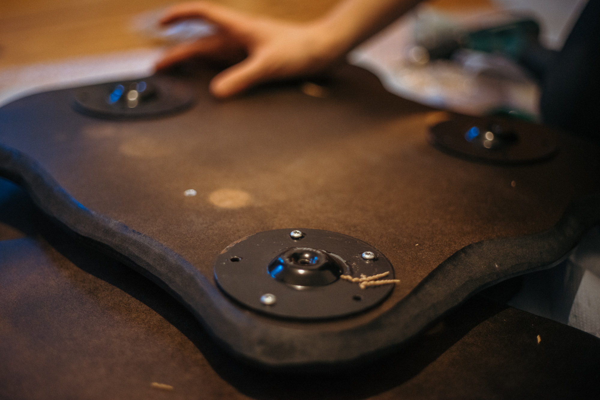
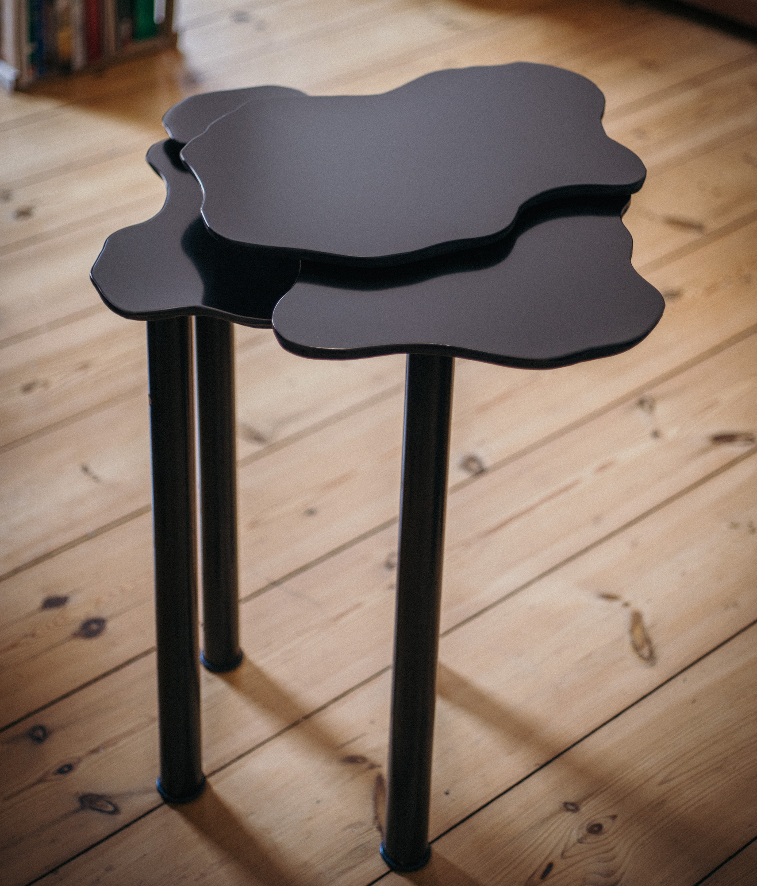
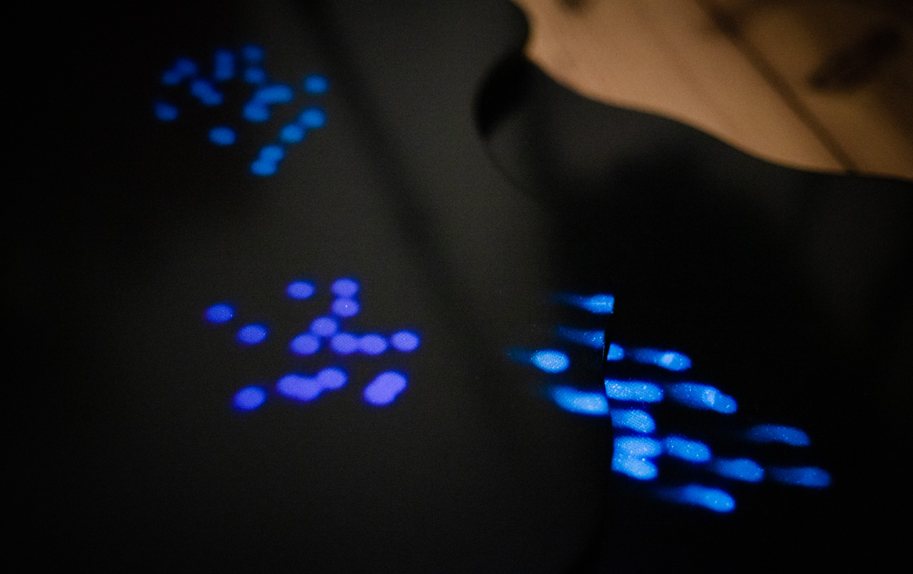

# Documentation

**ZEM** (*working title*)

Authors: Zainab Tariq, Anna Eschenbacher

Collaborators: Marie Scharnagl

Date: 30.09.2020

 

___

- [Abstract](#Abstract)
- [Concept](#Concept)
- [Implementation](#Implementation)
	- [Idea Development](#Idea_Development)
	- [Wooden Structure](#Wooden_Structure)
	- [Projection Mapping](#Projection_Mapping)
	- [TouchDesigner](#TouchDesigner)
		- [Node System](#Node_System)
		- [Boid System](#Boid_System)
		- [Movement of boids](#Movement_of_boids)
		- [Boundaries for projection](#Boundaries_for_projection)
		- [Interaction](#Interaction)
- [Results](#Results)		
- [Project Reflection & Discussion](#Project_Reflection_and_Discussion)
- [Lessons Learned](#Lessons_Learned)

## Abstract

This project is an interactive installation that addresses the topic of human impact on the marine ecosystem. We tackle the issue regarding the degradation of coral reefs and with it the extinction of marine species. The installation consists of a wooden structure that resembles coral plates that are layered on top of each other. Fish like organisms are projected on the horizontal area of the wooden structure. The users can interact with these organisms with their hand movements. 

## Concept

The main concept for this project was to do an interactive installation, which consists of a wooden structure as a projection surface. The projected visuals are abstract schools of fish. When the audience approaches the installation the fishes react according to the hand movement of the user. 
Through this installation, we want to bring attention to the human impact on the marine ecosystem, in this case on coral reefs and it's inhabitants. This is also depicted in the form of the structure, which resembles coral reefs, more specifically Acropora Hyacinthus coral plates. 

Human activities affect marine ecosystems as a result of pollution, overfishing, oil spills, and acidification, which lead to the extinction of marine species and have a major effect on the biodiversity of marine life forms. The effect on the ecosystem can be noticed through the rapid worldwide decline in coral reefs. Coral reefs are the most diverse marine ecosystems on earth, giving shelter to thousands of animal species. They account for one-third of all biodiversity in the oceans and are vital to humanity. As a result of human influence, over [50 percent](http://www.secore.org/site/corals/detail/why-coral-reefs-need-our-help.23.html) of the world’s coral reefs have died in the last 30 years and up to 90 percent may die within the next century. 

*Acropora Hyacinthus coral plates*

 

In this prototype the human influence on nature is represented through the hand interaction of the viewer, which leads to the movement of the fishes in the opposite direction, giving an impression of fleeing. More complex forms of interaction are mention in section [Future work](#Future_Work). 

## Implementation

### Idea_Development

From the very beginning, it was clear to us that we wanted to address the topic of climate change or human impact on different ecosystems. For brainstorming and making a list of resources we used [Miro board](https://miro.com) since it is excellent for getting an overview and all parties can edit the board. It helped us in finalizing our concept as well as for resource management. After the initial brainstorming session, we decided on implementing visuals in TouchDesigner since both of us wanted to get in touch with this tool. For the interaction, we thought of using either Kinect or LeapMotion. 

*Miro Board*


**Concept sketch** 

This is the first concept sketch we came up with. The idea was that the structure resembles coral plates and the interaction possibility is with the hand movements. We also wanted to use some sort of container with water to generate water reflection around the area of installation with the help of lights. 


### Wooden_Structure

We collaborated with **Marie Scharnagl** a carpenter apprentice. With her, we discussed using different materials and decided to use MDF wooden boards for the structure for several reasons. It is for once cost-saving and we could use leftover material from Marie's workshop. Also, MDF is softer than other wooden materials, which is optimal for cutting the curves and diagonal edges that we wanted. As mentioned above the plates are cut in the form of coral plates that are stacked on top of each other. We discussed different factors regarding the design, e.g how many plates we wanted to use, how they are distributed, what size they have. We decided on using fewer plates but in bigger sizes so that we have a larger projection field which provides us with a continuous projection area. The distance in height between the plates was also an important aspect for the continuous projection and to avoid interruption. For the color, we decided to use semi-glossy black paint to get high contrast and enough reflection for the projection.

**First cut test**

The first test plate can be seen in the figure below. We tested different aspects regarding the material, form, and thickness of the plate. 

 

**Assembly**

After the paint was dry we assembled all the plates and mounted them on four table legs in order to get the necessary height. For now, we used non-adjustable legs but in the future, we would like to substitute it with telescope desk legs, so that the height of the structure can be adjusted accordingly. 

 

  


**Finished Table**

  


  

### Projection_Mapping

In order to get optimal visual results, we tested the projection on different surfaces and colors. The best results in terms of contrast and reflectivity we achieved were on dark surfaces, hence it was decided to paint the MDF boards in black semi-gloss paint. We also had to make sure that the projector had enough lumen since black surfaces require more light intensity. 

Below are the first test results on a darker surface for distance (1.1m distance for 50" projection) with Epson TW-650 projector.

 

### TouchDesigner

In order to get familiar with TouchDesigner we followed [several tutorials](https://www.youtube.com/watch?v=Z_WfldiO6HI&list=PLFrhecWXVn5862cxJgysq9PYSjLdfNiHz), that included working with different operators such as TOP, CHOP, SOP, MAT, DAT, and COMP. Different types of operators are used for different purposes and classes, for example, **TOPs** are texture operators and work with 2D imagery (pixels), videos, 2D shapes, and text. **CHOPs** are channel operators and work with data/signals. **SOPs** are surface operators and are used for 3D geometry. **MATs** are material operators and **DATs** are used for scripts, texts, and GLSL. Last but not least are **COMPs**, they are a combination of several operators and include elements such as camera, light, animation, etc. 

Some of our results from the tutorials are as following:

 

  

 

#### Node_System

For this prototype we used different operators, for example for the shape of the fishes we used Sops operators, for scripting DAT, for rendering and postprocessing we used Tops, for the target position, movement, and for audio, we used Chop operators. 

*Node network in touchDesigner*


The shape of one single fish is a simple sphere. We use a grid and a copy node to multiply the sphere to each vertice of the grid. Through this, we get the initial number of spheres for the boids. For the behavior of the fishes, we wrote a python script which is explained in [section Boid System](#Boid_System). The boids follow a target which is a sphere with random position. This is achieved by using a noise node for the transform of the target sphere. The target is switched to the input from leap motion if there is an interaction. We use a switch node for this and address it in the script. The sphere is rendered through the render node. We used a simple Phong material node for the shading. With the feedback node, we generate soft trails so that the spheres look similar to fishes. In this first prototype, we use a simple mask based on the outline of the coral structure in order to create boundaries. 

#### Boid_System

The boid system we implemented is based on the pseudocode from http://www.kfish.org/boids/pseudocode.html. Which is an explanation of the standard algorithm as described by Reynolds. The system follows the following 5 rules. 

The Boids Rules
- Rule 1: Cohesion - boids try to fly towards the centre of mass of neighboring boids.
- Rule 2: Separation - Boids try to keep a small distance away from other objects (including other boids).
- Rule 3: Alignment - Boids try to match velocity with near boids.
- Rule 4: Boundaries - Bounding the position of the boids
- Rule 5: Target - Boids move towards a target
- We also limit the speed.

Some of the values can be manipulated in the node system of touchDesigner, for instance, the amount of cohesion, separation, alignment, speed limit, target scale, boundary scale, and the minimum distance the boids should have. 

#### Movement_of_boids 

As mentioned above the boids follow a sphere that moves randomly around the area. This effect is obtained by using noise node that is mapped to the transform position of the target. The target is a sphere as long as the leap motion has no input. If the leap motion is connected the target switches to the users' hand. This functionality is implemented in the script. To get a smooth movement of the boids we used the math node for mapping the right values of the hand input to the target's transform.  

*Nodes for the target*


#### Boundaries_for_projection

Instead of using an external projection mapping software, we decided to make a mask in TouchDesigner and use it as a projection area. The movement of the boids are restricted to this mask. The direction of movement changes if the fishes get closer to the boundaries. 

*Nodes for the mask*


#### Interaction

The main interaction for this prototype is hand movement which influences the direction of the fishes. The user can steer the fish swarms by moving the hand sideways or forward/backward. In touchDesigner, we used the leap motion node to get leap motion input. It has several channels such as hand detection or each finger. For the prototype, We decided to use finger input since the values for finger detection are more precise. We used select and math node to map the x-axis and z-axis values of the finger to the target x and y position. Target is either random or if there is a leap motion input it's the finger position. The switch between the target is realized through a switch node and python scripting. 

*Interaction sketch*


*Interaction nodes*


*code snippet for interaction*

```python
	leap = op('leapmotion')[2]
	switchTarget = op('switch1')

	# if hand is detected switch target to hand
	if leap.eval() != 0:
		switchTarget.par.indexfirst = 1
		# invert direction on x axis
		target = np.array([-(targetOP[0].eval()),targetOP[1].eval(),targetOP[2].eval()])
	else:
		switchTarget.par.indexfirst = 0
		target = np.array([targetOP[0].eval(),targetOP[1].eval(),targetOP[2].eval()])
```

## Results

### First Prototype

[](https://vimeo.com/463482923)

**[Video link](https://vimeo.com/463482923)**

 

 


## Project_Reflection_and_Discussion

What worked well for this project was the teamwork. We distributed the workload accordingly and each team member had their specific tasks. Although, most of the time we worked together in solving issues or problems. So far, the coral structure is one part of the project that is furthest developed and is in the state as planned. Through this project, we could gain basic knowledge in touchDesigner. We not only learned the basic components and functionality of touchDesigner but also what kind of projects can be implemented with it. However, we underestimated the time required to get to know touchDesigner. We invested a large amount of time in following tutorials and experimenting with different visuals. Initally we had planned to develop the project further than just a first prototype but this was not possible due to time constraints and hardware issues, e.g leap motion didn't work with windows due to SDK issues. 

### Future_Work 

Future goals for this project include having more organic and complex visuals for the fishes. We also want to add atmospheric particles to achieve the looks similar to an ecosystem with many organisms. Furthermore, we want to integrate not only ambient sound but also sound that reacts to the interaction and the movement of the fishes. As initially planned, we would also like to have water reflections in the room where the installation takes place in order to create underwater ambiance. Regarding the interactivity, we want to implement more complex forms of interaction. One idea would be to expand the hand interaction. Fish swarms would not only react to the hand movement but the movement would also generate an oil film-like substance that expands over the coral board. The fish would then decrease in velocity according to the density of the oil. The final results would then be fish swarms frozen in a dense substance transforming the installation from a vivid and dynamic looking environment to still life. Through this, we want to bring attention to the many oil spills occurring often in our oceans and endangering wildlife and are a threat to whole ecosystems. We want to emphasize this transformation through the change of colors, starting with more organic colors and moving on to the artificial (neon) color palette of the oil. 

Following are some images for the concept of the oil film. 

 

 

## Lessons_Learned

As mentioned above we underestimated the time needed for learning touchDesigner. TouchDesigner is a super powerful tool that can be used for a huge variety of applications. It has a complex structure of operators that requires time and experience to get proficient in. Never underestimate the time required to debug technical issues. We had some problems for instance with connecting the leap motion to windows. We learned that when planning on doing a physical installation it is good to collaborate with people who have expertise in building wooden structures. It was a great help having Marie in our team. So far this project has proven to be a good opportunity to learn touchDesigner, since both of us always wanted to get work with it. It was fun to work on a physical and interactive installation rather than just a software or digital project. As we've discovered before it is really helpful to work on a project in a team rather than alone because not only do we motivate each other but it's easier to overcome challenges and we learn from each other. 
